# Computer Networks  

## VLAN Trunking Protocol (VTP) Configuration  

### [elqabasy/gu/network/Assingment1](https://github.com/elqabasy/university/tree/main/S5/Network/assignments/A1)

**ID:** 223106831

**NAME** *Mahros AL-Qabasy*  

**VTP Domain:** [elqabasy.github.io](https://elqabasy.github.io)

**VTP Password:** M@hr0s  

---

## 1. Project Overview

This project demonstrates the configuration and verification of VLANs using **VLAN Trunking Protocol (VTP)** in a small enterprise network. The network consists of three switches and a router, connected as follows:

```
R1 <-> SW0-CORE-MAHROS <-> SW1-ACCESS-MAHROS <-> SW2-ACCESS-MAHROS
```

- **SW0**: VTP Server  
- **SW1**: VTP Client  
- **SW2**: VTP Client  
- VLANs: 10 (IT Department), 20 (HR Department)  
- Inter-VLAN routing is performed using **Router-on-a-Stick** with R1.

---

## 2. Topology Overview

All devices and connections were created in **Packet Tracer**. The network is structured to ensure proper VLAN isolation, trunking between switches, and inter-VLAN routing.  

**Connections:**

| Device 1 | Port  | Device 2 | Port |
|----------|-------|----------|------|
| R1       | Fa0/0 | SW0      | Gi0/2 |
| SW0      | Gi0/1 | SW1      | Gi0/1 |
| SW1      | Gi0/2 | SW2      | Gi0/1 |


**Screenshots:**  
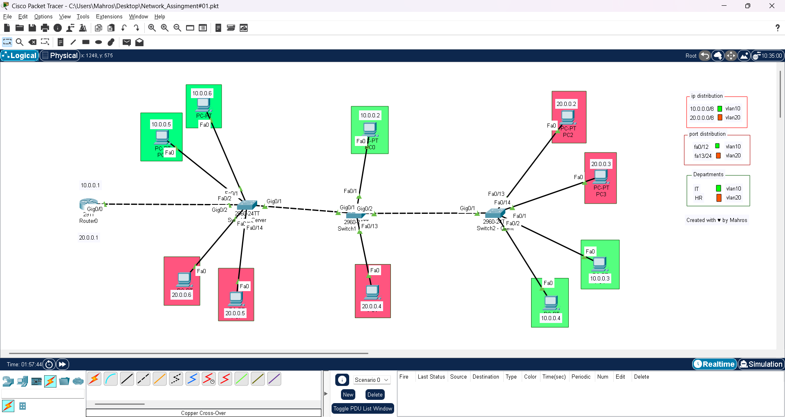

---

## 3. VTP Server Configuration (SW0-CORE-MAHROS)

**Objective:** Configure SW0 as VTP Server to propagate VLANs automatically.  

**Commands Used:**

```text
hostname SW0-CORE-MAHROS
vtp domain elqabasy.github.io
vtp password M@hr0s
vtp mode server

vlan 10
 name IT
exit

vlan 20
 name HR
exit
```

**Screenshot of VLAN creation:**


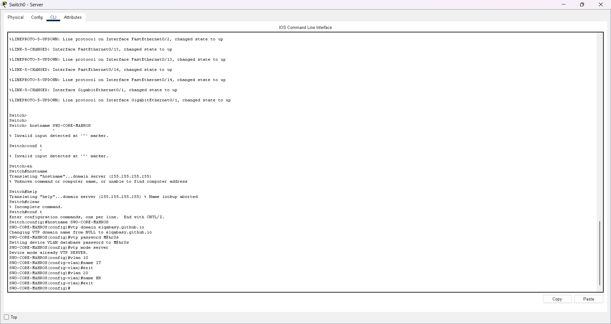
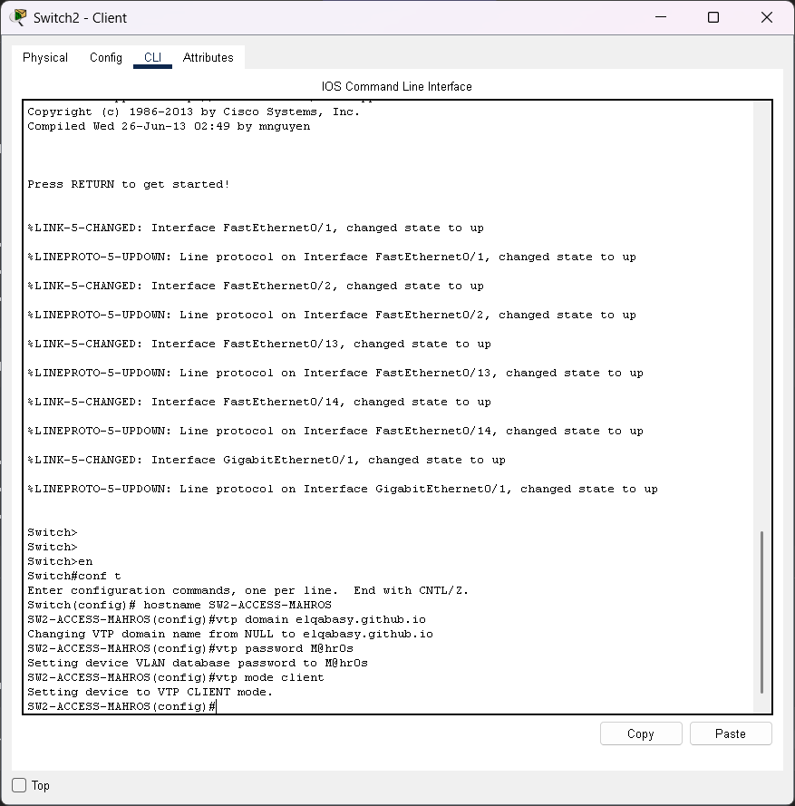
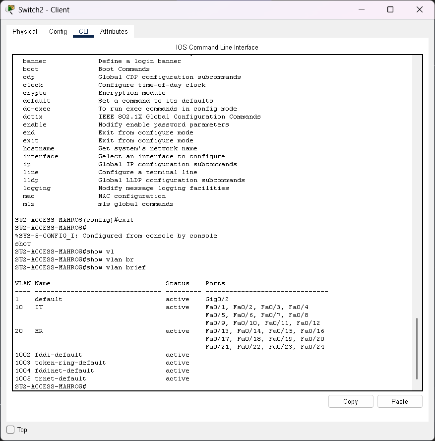

---

## 4. VTP Client Configuration (SW1 & SW2)

**Objective:** Configure SW1 and SW2 as VTP Clients to automatically synchronize VLANs from SW0.

**Commands Used (SW1 example):**

```text
hostname SW1-ACCESS-MAHROS
vtp domain elqabasy.github.io
vtp password M@hr0s
vtp mode client
```

**Commands Used (SW2 example):**

```text
hostname SW2-ACCESS-MAHROS
vtp domain elqabasy.github.io
vtp password M@hr0s
vtp mode client
```

**Screenshot of VTP Status Verification:**


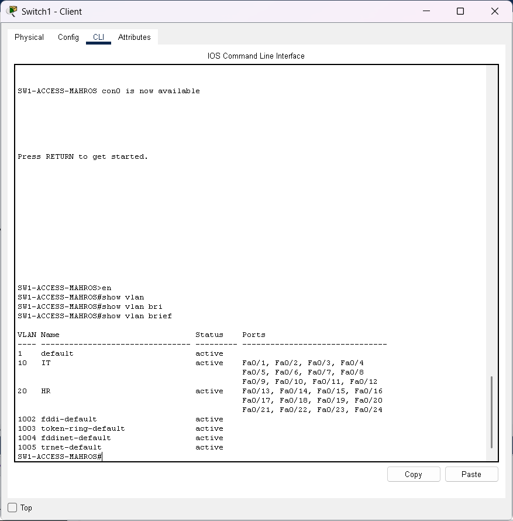
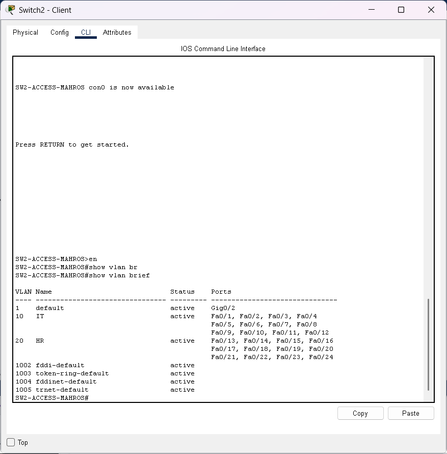

---

## 5. Trunk Configuration

**Objective:** Configure trunk links between switches to carry VLAN traffic and propagate VTP updates.

**Commands Example (SW0 to SW1):**

```text
interface gi0/1
 switchport mode trunk
 switchport trunk encapsulation dot1q
 switchport trunk allowed vlan 10,20
 description Trunk_to_SW1_Configured_by_mahros
```

**Other Trunks:**

- SW1 Gi0/2 -> SW2 Gi0/1
- SW0 Gi0/2 -> R1 Fa0/0

**Screenshot of Trunk Verification:**


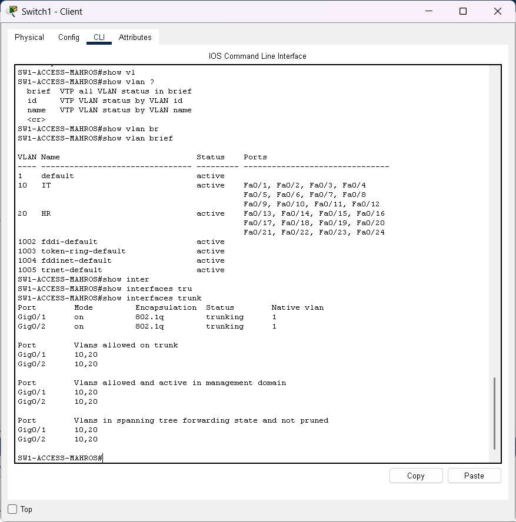
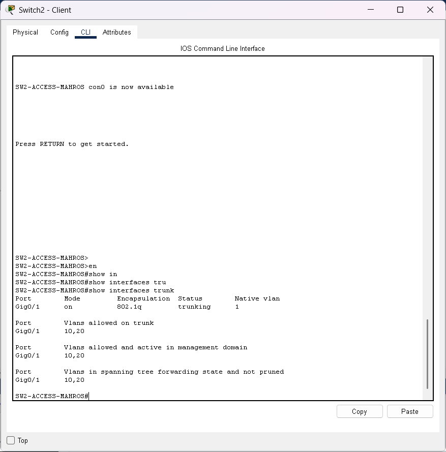

---

## 6. Access Port VLAN Assignment

**Objective:** Assign access ports to VLANs according to department.

**VLAN Mapping:**

- **VLAN 10 (IT Department)**: Fa0/1 – Fa0/12
- **VLAN 20 (HR Department)**: Fa0/13 – Fa0/24

**Commands Example (SW0):**

```text
interface range fa0/1 - 12
 switchport mode access
 switchport access vlan 10
 description IT_Department_PC_Port_Configured_by_mahros

interface range fa0/13 - 24
 switchport mode access
 switchport access vlan 20
 description HR_Department_PC_Port_Configured_by_mahros
```

**Screenshot of VLAN Assignment:**


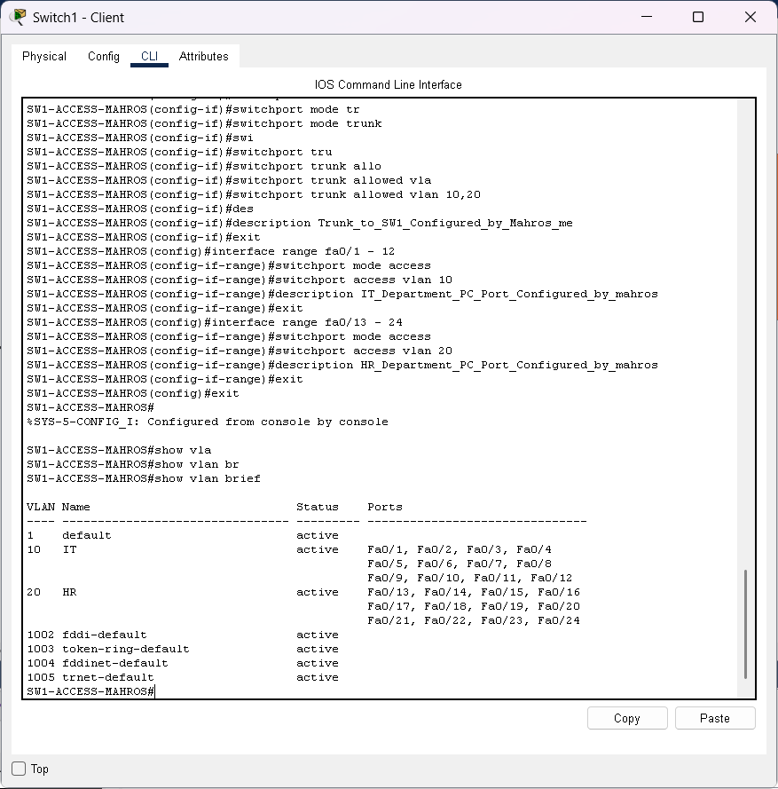

---

## 7. IP Addressing

**VLAN 10 – IT Department**

| PC  | IP Address | Subnet Mask | Default Gateway |
| --- | ---------- | ----------- | --------------- |
| PC0 | 10.0.0.2   | 255.0.0.0   | 10.0.0.1        |
| PC1 | 10.0.0.3   | 255.0.0.0   | 10.0.0.1        |

**VLAN 20 – HR Department**

| PC  | IP Address | Subnet Mask | Default Gateway |
| --- | ---------- | ----------- | --------------- |
| PC2 | 20.0.0.2   | 255.0.0.0   | 20.0.0.1        |

**Screenshot of PC IP Configuration:**


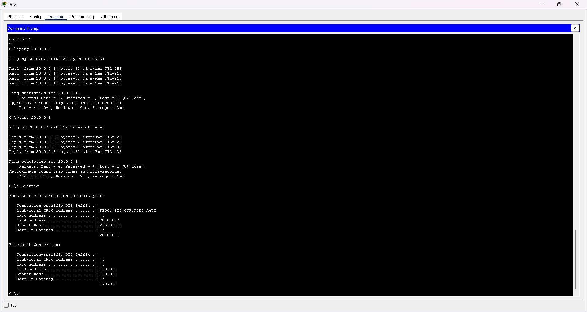

---

## 8. VLAN Communication Testing

**Intra-VLAN (Ping within VLANs):**

- PC0 -> PC1 (VLAN 10) -> Success
- PC2 -> PC2 (VLAN 20) -> Success

**Inter-VLAN (Ping across VLANs before router):**

- PC0 -> PC2 -> Fail (as expected due to VLAN isolation)

**Screenshot of Ping Test:**


---

## 9. Router-on-a-Stick Configuration (R1-MAHROS)

**Objective:** Enable inter-VLAN routing to allow communication between VLAN 10 and VLAN 20.

**Router Subinterface Configuration:**

```text
interface fa0/0.10
 encapsulation dot1Q 10
 ip address 10.0.0.1 255.0.0.0
 description VLAN10_IT_MAHROS

interface fa0/0.20
 encapsulation dot1Q 20
 ip address 20.0.0.1 255.0.0.0
 description VLAN20_HR_MAHROS

interface fa0/0
 no shutdown
```

**Update PC Default Gateways:**

- VLAN 10 PCs -> 10.0.0.1
- VLAN 20 PCs -> 20.0.0.1

**Screenshot of Router Interfaces:**


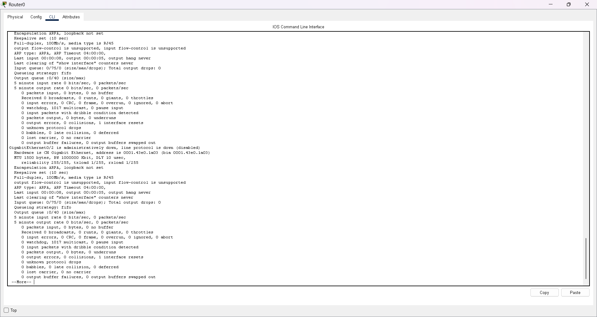

---


### *ID*: 223106831
### Computer Networks
### Created with **LOVE** by *Mahros*
